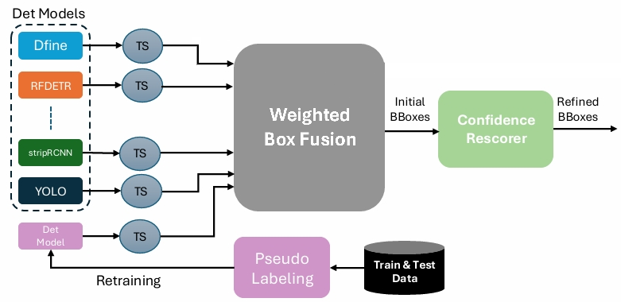

# ClearSAR Track 1 — 1st Place Solution (AIC-IBH)

> **IEEE ICIP 2026 · ClearSAR Challenge · Track 1**  
> Operational RFI detection in Sentinel-1 SAR quicklook (RGB) imagery  

---

## 🏆 Result

| Position | Team | mAP |
|----------|------|-----|
| **1st** | **AIC-IBH** | **0.5193** |
| 2nd | SpaceQuokkas | 0.5134 |
| 3rd | Capybara | 0.5119 |

---

## Overview

This repository contains the **full reproducibility package** for the AIC-IBH first-place solution to the [ClearSAR Track 1 Challenge](https://clearsar.github.io/) at IEEE ICIP 2026.

Our pipeline detects Radio Frequency Interference (RFI) artifacts in Sentinel-1 Level-2 GRD quicklook images. The solution combines:

- **10 diverse detection backbones** (transformer- and CNN-based)
- **Temperature-scaled score calibration** before fusion
- **Weighted Box Fusion (WBF)** for ensemble merging
- **Dual pseudo-labeling** for semi-supervised retraining on test data
- **RoI-based confidence rescorer** (ResNet-50 binary classifier) for TP/FP re-ranking



---

## Pipeline at a Glance

```
Test Images
    │
    ▼
┌─────────────────────────────────────────────┐
│  5 Docker Containers (10 detector models)   │
│  ┌──────────┐ ┌──────────┐ ┌─────────────┐  │
│  │Strip-RCNN│ │D-FINE    │ │RF-DETR (x2) │  │
│  │DEIMv2    │ │YOLOv11   │ │MMDet (x5)   │  │
│  └──────────┘ └──────────┘ └─────────────┘  │
└─────────────────────────────────────────────┘
    │  Per-model JSON predictions
    ▼
Temperature Scaling  →  Weighted Box Fusion (WBF)
    │  Initial BBoxes
    ▼
RoI Confidence Rescorer (ResNet-50 binary head)
    │  Refined BBoxes
    ▼
ensemble_wbf_test_final.json  ✓
```

---

## Repository Structure

```
.
├── run_all.sh        # Step 1 — pull Docker images & run all detectors
├── adjust_jsons.py         # Step 1b — post-process JSON IDs after inference
├── ensemble.py             # Step 2 — WBF fusion + RoI rescorer
├── ckpts/
│   └── classifier/
│       └── roi_classifier_best.pth   # Pre-trained RoI rescorer checkpoint
├── output/                 # Final ensemble JSON is written here
├── figures/
│   └── det_pipeline_.png/
└── README.md
```

---

## Prerequisites

### Hardware
- NVIDIA GPU with CUDA support (tested on H100)
- ≥ 32 GB GPU VRAM recommended for the full ensemble

### Software
- Docker with NVIDIA Container Toolkit (`nvidia-container-toolkit`)
- Python ≥ 3.9
- `sudo` privileges (required for Docker GPU passthrough)

### Python Dependencies

```bash
pip install torch torchvision ensemble-boxes pycocotools tqdm pillow
```

---

## Step-by-Step Reproduction

### 1 — Prepare the Test Data

Download the official ClearSAR Track 1 test images from the challenge platform and place them in a directory of your choice, e.g. `/data/clearsar/test`.

---

### 2 — Configure `run_all.sh`

Open `run_all.sh` and set the two variables at the top:

```bash
# Absolute path to your test images directory
TEST_IMAGES_DIR="/data/clearsar/test"

# Absolute base directory where all model outputs will be written
BASE_DIR="/data/clearsar/workspace"
```

> **Note:** Both paths must be **absolute**. Relative paths will cause Docker volume mount failures.

---

### 3 — Run All Detectors

```bash
chmod +x run_all.sh
./run_all.sh
```

This script will:

1. Create all output subdirectories under `$BASE_DIR`
2. Pull and execute **5 Docker containers** sequentially, each mounting the test images and writing JSON predictions to their respective output folder:

| Container | Output Directory | Models Inside |
|-----------|-----------------|---------------|
| `strip-rcnn-reproducibility-v1` | `strip-rcnn-output/` | Strip-R-CNN |
| `define-yolo-reproducability` | `outputs_dino_yolo/` | D-FINE, YOLOv11, Exp08b |
| `rf_detr` | `rf-detr-output/` | RF-DETR (base + pseudo-label retrain) |
| `mmdetection` | `mmdetection-output/` | CO-DETR, DINO, DDQ-DETR, RTMDet, GLIP |
| `deimv2-infer` | `deim-output/` | DEIMv2 |

3. Reclaim file ownership from root (`chown`)
4. Run `adjust_jsons.py` to normalize image IDs across all JSON outputs

Expected runtime: **~30–60 minutes** depending on GPU and network speed.

---

### 4 — Configure `ensemble.py`

Open `ensemble.py` and make **two small edits** at the bottom of the file:

**Edit 1 — Strip-R-CNN output filename** (this changes with each run):

```python
test_json_paths = [
    "strip-rcnn-output/<TIMESTAMP>.json",  # ← update this filename
    ...
]
```

Check the actual filename generated:

```bash
ls $BASE_DIR/strip-rcnn-output/
```

**Edit 2 — Test images directory:**

```python
test_images_dir = "/data/clearsar/test"   # ← match your TEST_IMAGES_DIR
```

---

### 5 — Run the Ensemble

```bash
python ensemble.py
```

The script will:

1. Load all 13 prediction JSON files
2. Apply per-model temperature scaling
3. Run Weighted Box Fusion (WBF) with `iou_thr=0.7`, `skip_box_thr=0.06`
4. Run the RoI confidence rescorer (`insight_driven` strategy) to downweight low-confidence FPs
5. Write the final result to:

```
output/ensemble_wbf_test_final.json
```

---

## Key Hyperparameters

| Parameter | Value |
|-----------|-------|
| WBF IoU threshold | 0.7 |
| WBF skip box threshold | 0.06 |
| RoI classifier strategy | `insight_driven` |
| RoI pooling output size | 7 × 7 |
| RoI spatial scale | 1/32 |

**Model weights and temperature values used in final submission:**

| Model | WBF Weight | Temperature |
|-------|-----------|-------------|
| Strip-R-CNN | 0.6 | 1.50 |
| DEIMv2 | 0.0 | 0.90 |
| RF-DETR (base) | 2.5 | 0.60 |
| YOLOv11 | 3.8 | 1.00 |
| D-FINE ensemble | 3.0 | 0.60 |
| RF-DETR (pseudo) + MMDet models | 0.0 | — |

> Models with `weight=0.0` do not influence box geometry or confidence but still contribute to the WBF agreement signal (incrementing *P* in Equation 1).

---

## Method Summary

### Weighted Box Fusion with Agreement Penalty

WBF merges overlapping detections from all models. The fused confidence score is:

$$s^* = \frac{\sum_{i \in C} w_{m(i)} \cdot s_i}{\sum_{i \in C} w_{m(i)}} \cdot \frac{P}{N}$$

where *P* = number of boxes in the cluster and *N* = total number of models. The *P/N* factor penalises boxes supported by few models.

### Temperature Scaling

Per-model sigmoid calibration before WBF aligns confidence semantics across heterogeneous architectures, preventing overconfident models from dominating fusion.

### Dual Pseudo-Labeling

1. **Self-training** on the training set to recover missing ground-truth annotations
2. **Semi-supervised** pseudo-annotation of the test set for targeted model retraining

### RoI Confidence Rescorer

A ResNet-50 binary classifier trained on 43,508 balanced TP/FP RoI crops from training-set inference. Applied post-WBF via the `insight_driven` strategy: boxes where both WBF confidence and classifier probability fall below threshold have their scores downweighted.

---

## Troubleshooting

**Docker permission errors**

```bash
# Add your user to the docker group (requires re-login)
sudo usermod -aG docker $USER
```

**GPU not visible inside container**

```bash
# Verify nvidia-container-toolkit is installed
nvidia-container-cli info
```

**Strip-R-CNN JSON not found**

The Strip-R-CNN container generates a timestamped JSON filename. Check `strip-rcnn-output/` after the bash script completes and update the path in `ensemble.py` accordingly.

**`adjust_jsons.py` fails with permission error**

The script is called with `sudo` inside `run_all.sh`. If running manually, ensure you have write access to all output directories or prefix with `sudo`.

---

## Team

**AIC-IBH** · Applied Innovation Center, MCIT — Egypt

- Ziad Fahmy
- Abdelrahman Elnenaey
- Nour Eddine Hassan
- Youssif Abdelaziz
- Nada H. Mourad

---

## License

This reproducibility package is released for academic and research use in the context of the ClearSAR Challenge reproducibility phase. Model weights and Docker images are provided as-is for evaluation purposes only.
